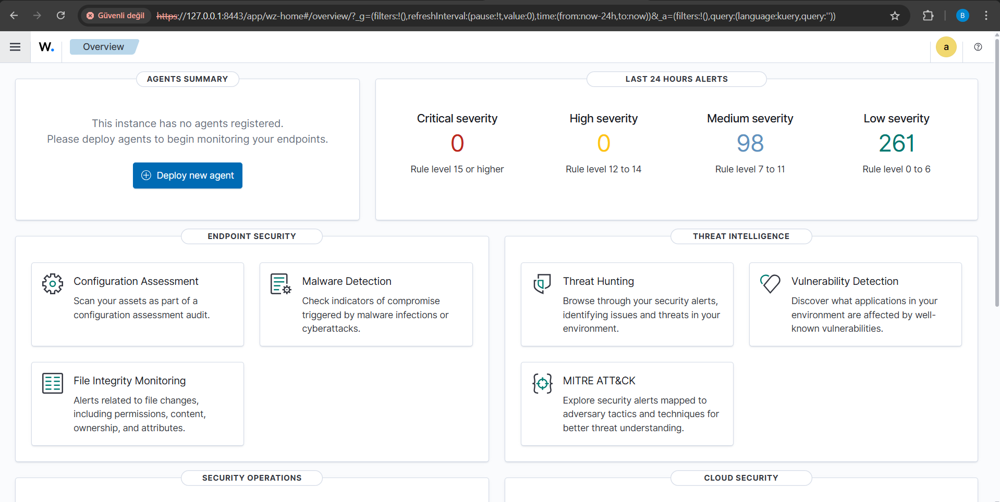
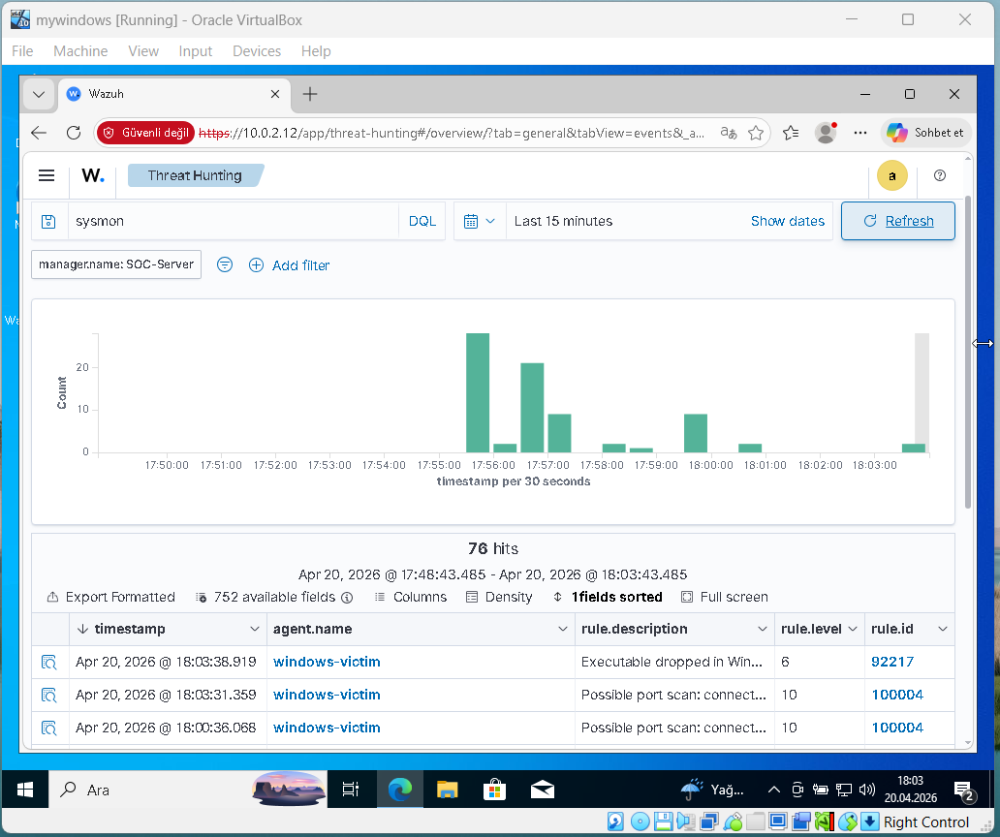
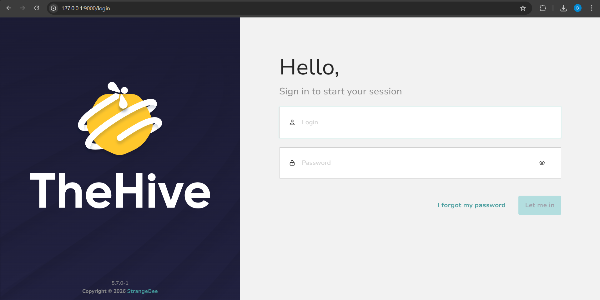
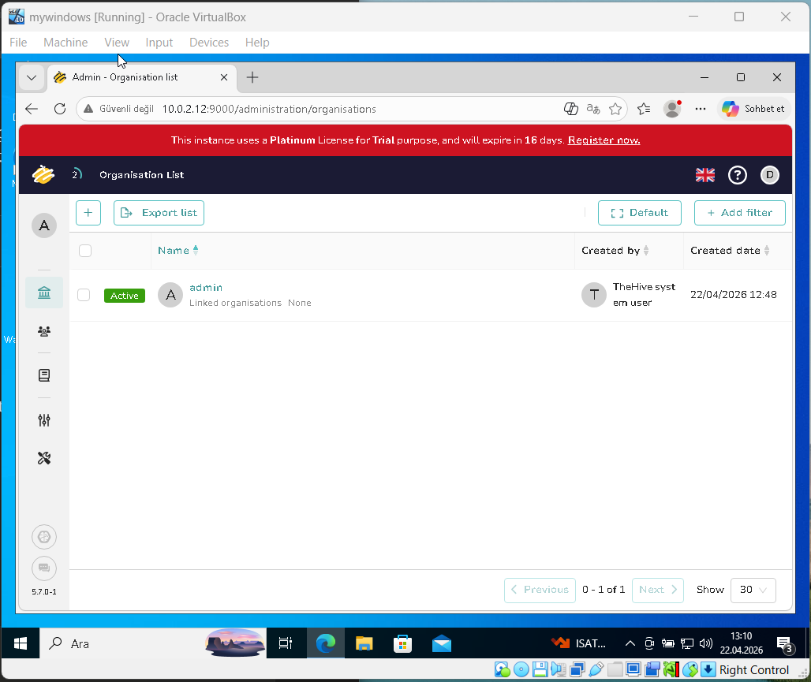
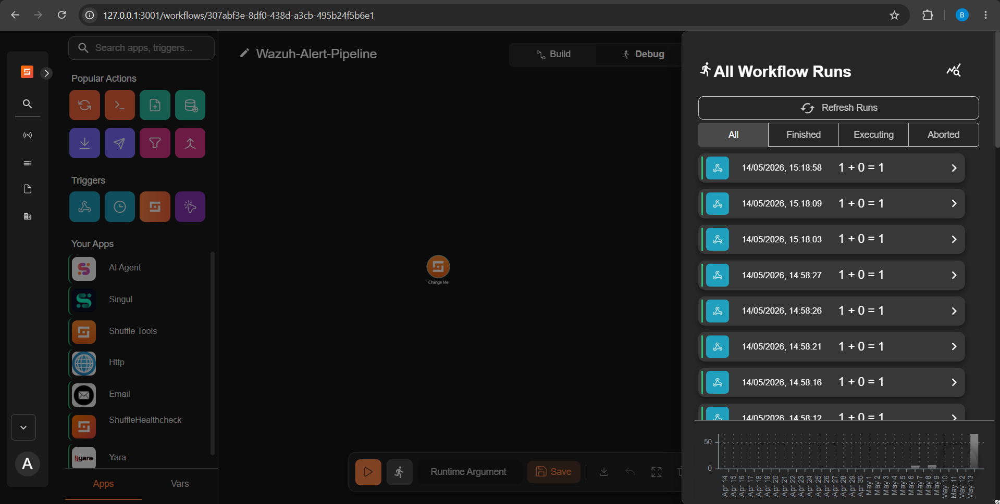
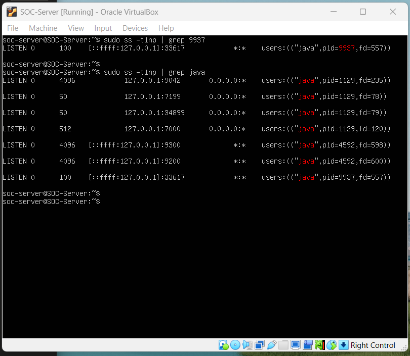

# 🛡️ Mini SOC Lab — Home Lab Security Operations Center Simulation

A fully functional Security Operations Center (SOC) simulation built on a home lab environment using VirtualBox. This project demonstrates real-world SOC capabilities including threat detection, log management, security automation, and incident response workflows.

## 📋 Project Overview

This lab simulates a production SOC environment with three core platforms working in an integrated pipeline:

- **Wazuh SIEM** — Collects, analyzes, and correlates security events from endpoints
- **TheHive** — Case management and incident response platform
- **Shuffle SOAR** — Security orchestration and automated response workflows

**Alert Pipeline:** Wazuh Agent → Wazuh Manager → Shuffle SOAR (Webhook) → TheHive (Case Creation)

## 🖥️ Lab Environment

| Component | Specs |
|-----------|-------|
| Host OS | Windows 10 |
| Host RAM | 8GB |
| Hypervisor | Oracle VirtualBox |
| Network | NAT Network (10.0.2.0/24) |

| VM | OS | RAM | IP | Role |
|----|-----|-----|-----|------|
| SOC-Server | Ubuntu Server 22.04 | 5GB | 10.0.2.12 | SIEM + SOAR + Case Management |
| mywindows | Windows 10 Pro | 2GB | 10.0.2.8 | Monitored Endpoint |
| Kali Linux | Kali 2024 | 2GB | 10.0.2.7 | Attacker Simulation |

## 🔧 Installed Components

### SOC-Server
- **Wazuh 4.x** — All-in-One deployment (Manager + Indexer + Dashboard)
- **TheHive 5.7.0** — Incident response and case management platform
- **Apache Cassandra 4.1.x** — TheHive database backend
- **Shuffle SOAR** — Deployed via Docker Compose
- **OpenSearch 3.2** — Shuffle database backend
- **2GB Swap** — RAM optimization for 8GB host constraint

### Windows Endpoint
- **Wazuh Agent** — Active, reporting to SOC-Server
- **Sysmon v15.15** — Deployed with SwiftOnSecurity configuration

## ✅ Completed Features

### 1. Wazuh SIEM
- Full Wazuh stack deployed and operational
- Windows 10 endpoint monitored with active Wazuh agent
- Real-time event collection and correlation
- Custom dashboard configuration

### 2. Sysmon Integration
- Sysmon v15.15 installed with SwiftOnSecurity ruleset
- Sysmon events forwarded to Wazuh manager
- Process creation, network connections, and file changes monitored

### 3. Custom Detection Rules — MITRE ATT&CK Mapped

| Rule ID | Name | MITRE Technique | Status |
|---------|------|-----------------|--------|
| 100001 | Brute Force Detection | T1110 | ✅ Active |
| 100002 | Mimikatz Detection | T1003 | ✅ Active |
| 100003 | Suspicious PowerShell | T1059.001 | ✅ Active |
| 100004 | Port Scan Detection | T1046 | ✅ Tested |
| 100005 | New Service Installation | T1543.003 | ✅ Active |
| 100006 | Scheduled Task Creation | T1053.005 | ✅ Tested |

### 4. File Integrity Monitoring (FIM)
- FIM configured on critical Windows directories
- Real-time alerts on file creation, modification, and deletion
- Wazuh rules 550 and 554 triggering correctly

### 5. Wazuh → Shuffle SOAR Pipeline
- Shuffle SOAR deployed via Docker Compose
- Wazuh integration configured in ossec.conf
- Webhook trigger receiving Wazuh alerts in real-time
- Alert data (rule ID, severity, timestamp, description) successfully parsed in Shuffle workflow
- Verified via integrations.log and Shuffle execution history

### 6. TheHive Case Management
- TheHive 5.7.0 deployed with Cassandra backend
- Integrated with Wazuh's internal OpenSearch (port 9200)
- Organization and analyst user configured

## ⚠️ Known Limitations

### TheHive Community License
TheHive 5.x community edition restricts operational features to non-admin organizations. Due to license quota limitations, alert creation via API is blocked in the admin organization. Migration to TheHive 4.x would resolve this issue as it has a more permissive community license model.

### RAM Constraints
With only 8GB host RAM, running all VMs simultaneously causes performance degradation. The following optimizations were applied:

- Cassandra heap limited to 512MB
- Wazuh Indexer heap limited to 512MB
- Shuffle OpenSearch heap limited to 256MB
- 2GB swap file added to SOC-Server
- Windows VM accessed via host port forwarding instead of direct VM GUI
- Kali Linux started only when needed for attack simulations

## 📁 Repository Structure

| Path | Description |
|------|-------------|
| `configs/wazuh/local_rules.xml` | Custom MITRE ATT&CK detection rules |
| `docs/01-lab-setup.md` | VirtualBox and VM configuration |
| `docs/02-wazuh-setup.md` | Wazuh SIEM installation guide |
| `docs/03-sysmon-setup.md` | Sysmon installation and Wazuh integration |
| `docs/04-detection-rules.md` | Custom detection rules documentation |
| `docs/05-fim-setup.md` | File Integrity Monitoring setup |
| `docs/06-thehive-setup.md` | TheHive installation and configuration |
| `docs/07-shuffle-setup.md` | Shuffle SOAR installation and integration |
| `scripts/start-all.sh` | Automated service startup script |

## 🚀 Quick Start

Run the automated startup script after booting SOC-Server:

```bash
./start-all.sh
```

Services must start in this order due to dependencies: Cassandra → Wazuh Indexer → Wazuh Manager → Wazuh Dashboard → TheHive (~8 min) → Shuffle (Docker)

### Access URLs — Host Machine via Port Forwarding

| Service | URL |
|---------|-----|
| Wazuh Dashboard | https://127.0.0.1:8443 |
| TheHive | http://127.0.0.1:9000 |
| Shuffle | http://127.0.0.1:3001 |

## 🛠️ Technologies Used

| Technology | Version | Purpose |
|-----------|---------|---------|
| Wazuh | 4.x | SIEM / EDR |
| TheHive | 5.7.0 | Case Management |
| Shuffle | Latest | SOAR |
| Apache Cassandra | 4.1.x | TheHive Database |
| OpenSearch | 3.2 | Shuffle Database |
| Sysmon | 15.15 | Windows Telemetry |
| Docker | Latest | Shuffle Deployment |
| Ubuntu Server | 22.04 LTS | SOC Server OS |

## 🎯 Skills Demonstrated

- SIEM deployment and configuration
- Security event correlation and custom rule writing
- MITRE ATT&CK framework mapping
- SOAR workflow design and automation
- Incident response platform integration
- Linux server administration
- Docker container management
- Network security monitoring
- File Integrity Monitoring (FIM)
- Windows endpoint security with Sysmon

## 📸 Screenshots

### 🛡️ Wazuh SIEM


*Wazuh Dashboard — Last 24 hours: 98 medium severity, 261 low severity alerts*


*Threat Hunting — Sysmon events from windows-victim agent. Custom rule 100004 detects port scan attempts (rule level 10).*

---

### 🐝 TheHive (Incident Management)


*TheHive 5.7.0-1 — running on port 9000*


*TheHive admin panel — accessible from Windows VM over the network (10.0.2.12:9000)*

---

### 🔀 Shuffle SOAR


*Wazuh-Alert-Pipeline workflow in Shuffle SOAR — multiple successful executions visible*

---

### 🖥️ Infrastructure


*SOC-Server active services: Wazuh OpenSearch (9200/9300), Cassandra (9042), TheHive (9000)*
